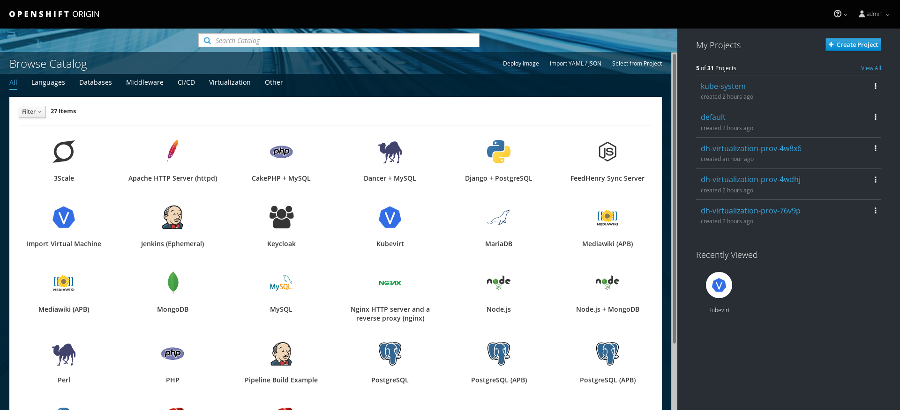
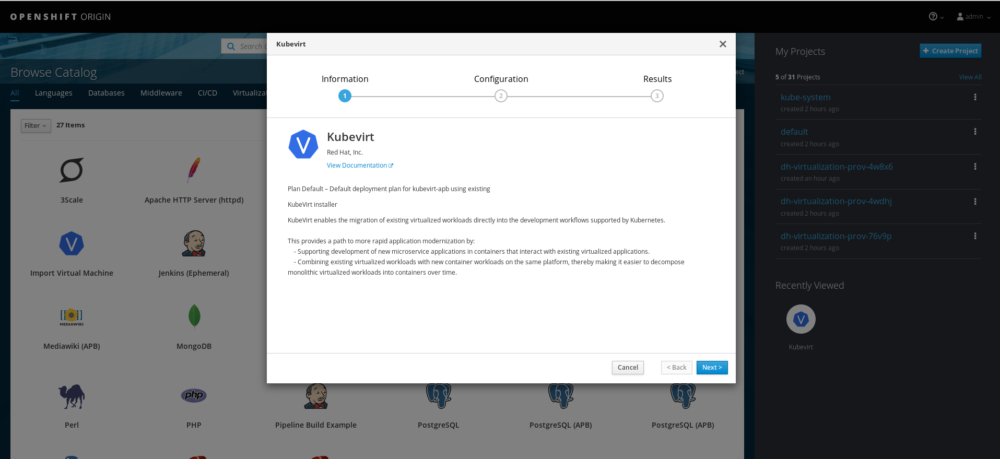
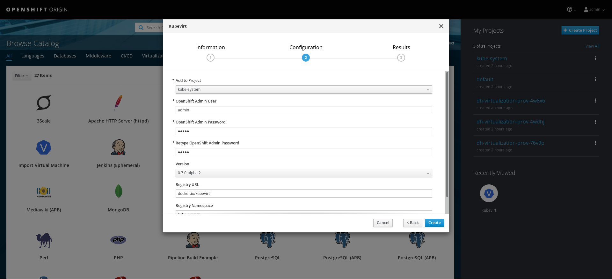

# KubeVirt APB Lab

## Deploy OpenShift/Kubernetes
There are many ways to deploy OpenShift and Kubernetes.  If you already have an
existing cluster or know want to use a different guide for setting up a cluster
then you can skip this section.  This guide will use ```oc cluster up``` to
deploy:
 - Single node OpenShift cluster
 - Service-Catalog
 - Ansible-Service-Broker

```bash
docker cp $(docker create docker.io/openshift/origin:v3.10):/usr/bin/oc ~/bin/oc

TAG=v3.10 oc cluster up --tag=${TAG} --image=docker.io/openshift/origin-\\${component}:\\${version} --enable=service-catalog,template-service-broker,router,registry,web-console,persistent-volumes,sample-templates,rhel-imagestreams,automation-service-broker

oc login -u admin -p admin
```

## Run the KubeVirt APB

### Open the Console
Open the console UI in your browser located at: ```https://<my_ip>:8443/console```
and you should see the Service-Catalog UI.



### Select the KubeVirt Icon
This is the KubeVirt APB



### Configure and Create the KubeVirt APB
Fill out the fields to run the APB:
  - Add to Project: "The project the serviceinstance will run in"
  - OpenShift Admin User: "Admin user"
  - OpebShift Admin Password: "Password for the admin user"
  - Version: "KubeVirt version"
  - Registry URL: "Container registry to pull the Kubevirt Images"
  - Registry Namespace: "Namespace to launch KubeVirt pods"




